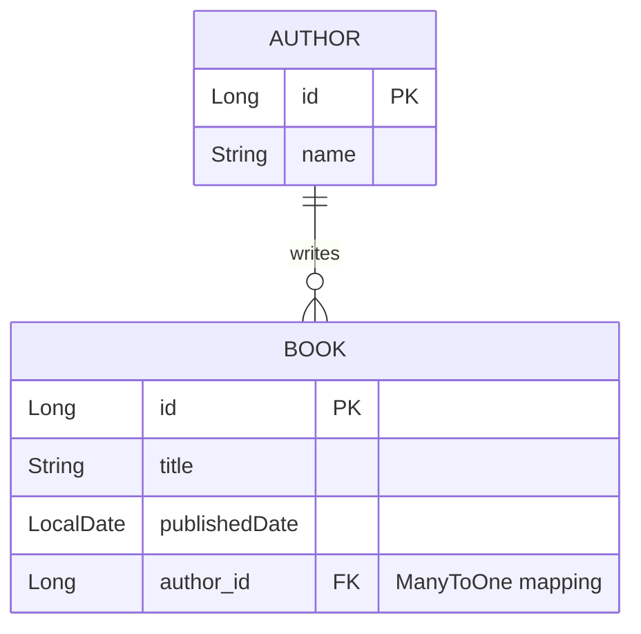

# Library Management System API

A Spring Boot REST API demonstrating relational database architecture and custom Spring Data JPA queries. This project manages a One-to-Many entity relationship between Authors and Books.

## 🛠️ Tech Stack
* **Java & Spring Boot**
* **Spring Data JPA / Hibernate**
* **PostgreSQL**
* **Lombok**

## 🚀 Core Features & Endpoints
* **Full CRUD Operations:** Standard Create, Read, Update, and Delete endpoints for `Author` and `Book` entities.
* **Relational Mapping:** Books are dynamically linked to Authors via a foreign key assignment (`author_id`).
* **Custom Derived Queries:**
  * `GET /books/search?title={title}` - Exact title match.
  * `GET /books/search/publishedAfter?date={date}` - Filters books published after a specific date.
  * `GET /books/author/{authorId}` - Retrieves a specific author's complete bibliography.
  * `GET /authors/search/{name}` - Locates authors by name.

